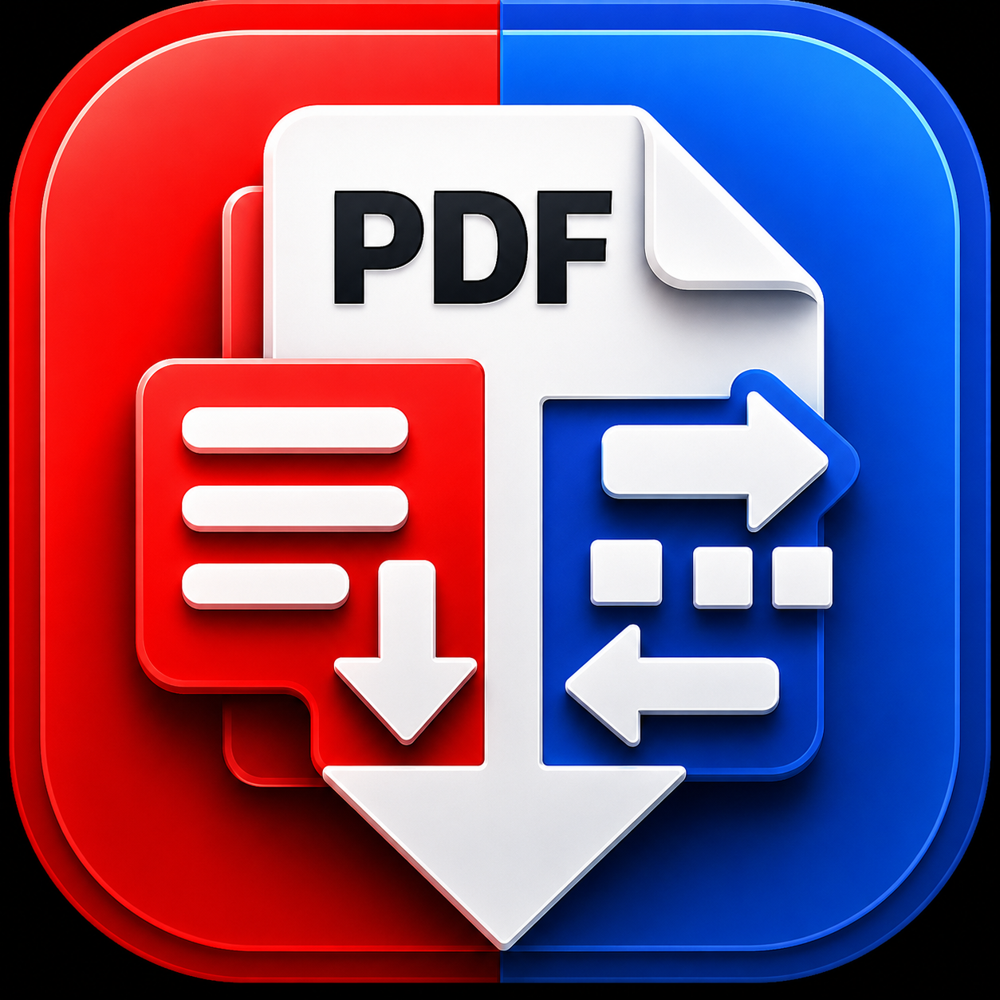

# PDF Split Merge Utility

  

  

A lightweight offline macOS utility for merging, splitting, and organizing PDF files locally.

No subscriptions.  
No cloud uploads.  
No accounts.  
Just drag, drop, and get work done.

---

# Features

- Merge multiple PDFs into one file
- Split PDFs into individual pages
- Split custom page ranges
- Reorder PDFs before merging
- Drag & drop support
- Dark / light mode
- Offline only
- Beginner-friendly interface
- No tracking or telemetry

---

# Screenshots

## Main Interface

---

## Adding PDFs

---

## Merge Results

---

## Split Results

---

## Page Range Splitting

---

## Before Processing

---

# Why This Exists

Most PDF tools online:
- upload your files
- require subscriptions
- are bloated
- cluttered
- privacy-invasive

PDF Split Merge Utility keeps everything local on your Mac.

Your files never leave your device.

---

# Installation

1. Download the ZIP
2. Extract the folder
3. Open the app
4. Right-click → Open on first launch if macOS shows a security warning

---

# Download

## Gumroad

https://gallonlabs.gumroad.com/l/pdf-split-merge-utility

## itch.io

https://tinyutilitylab.itch.io/pdf-split-merge-utility

---

# System Requirements

- macOS
- Apple Silicon or Intel Mac

---

# Privacy

Fully offline.

No accounts.  
No cloud processing.  
No telemetry.  
No tracking.

---

# Built With

- Python
- PySide6
- pypdf

---

# Future Improvements

- Thumbnail previews
- Page count display
- Additional export options
- Faster drag-and-drop workflows
